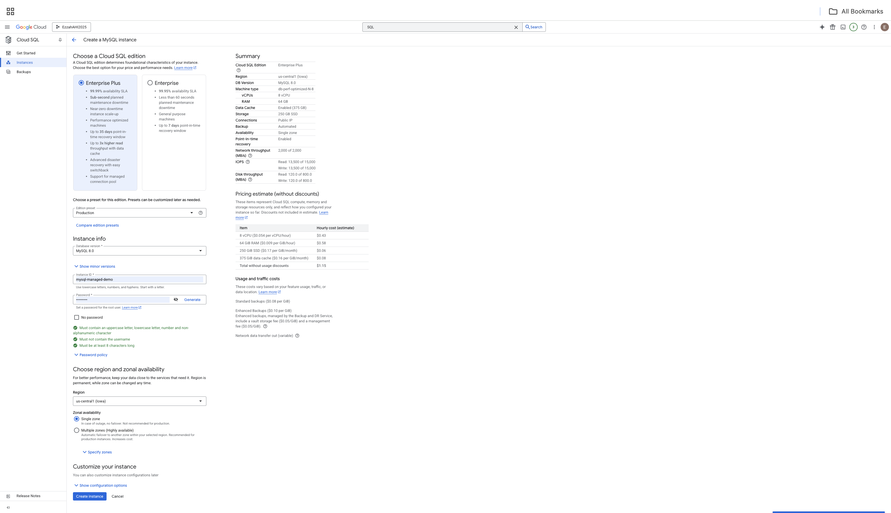
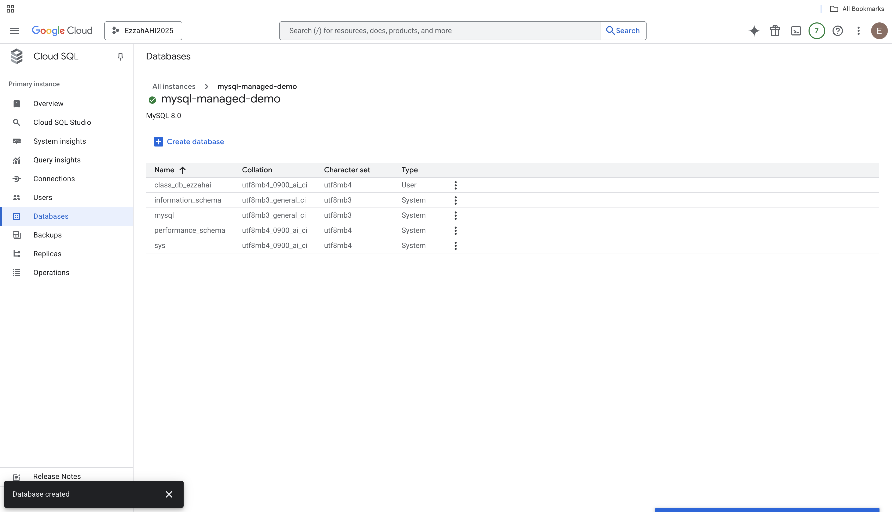
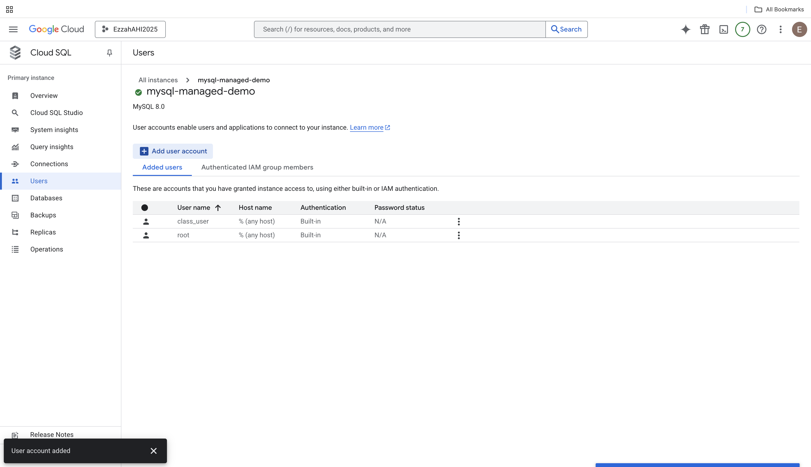
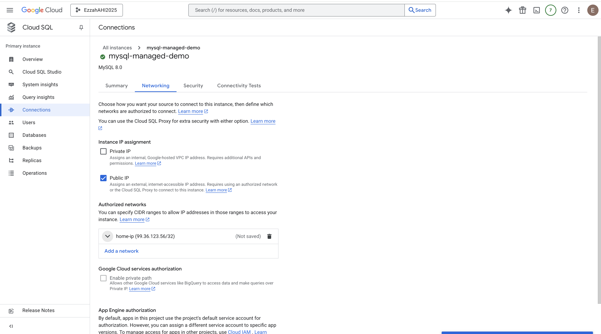
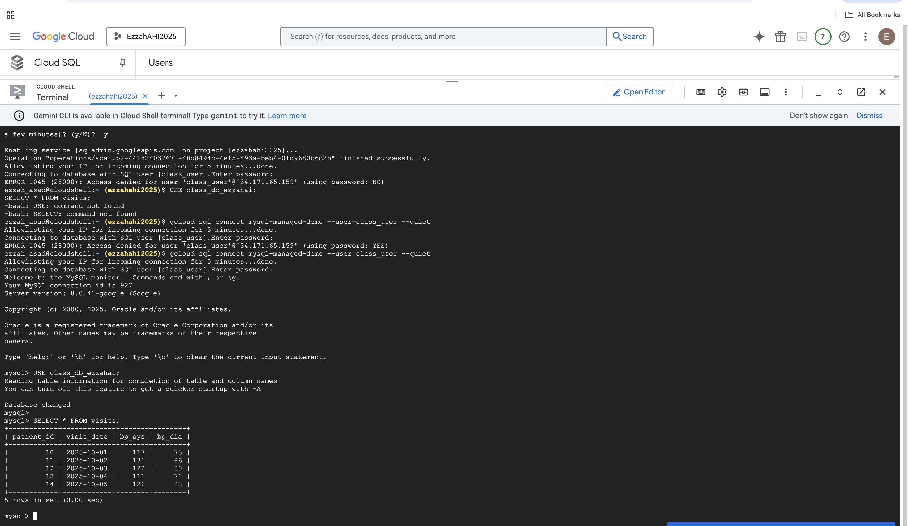

# Setup Notes — Managed MySQL (GCP Cloud SQL)

## 1. Managed Instance Provisioning (Cloud SQL)

**Cloud:** Google Cloud Platform  
**Service:** Cloud SQL for MySQL  
**Region:** us-central1  
**Tier:** db-f1-micro (shared CPU)  
**Storage:** 10 GB  
**Connectivity:** Public IP enabled  

### Steps Performed
1. Opened **Cloud SQL → Create Instance → MySQL**.
2. Selected:
   - MySQL version (8.x)
   - Region: **us-central1**
   - Machine tier: **db-f1-micro**
   - Storage: 10 GB
3. Set initial configuration:
   - Root password stored locally in `.env`
   - Default database: `class_db_ezzahai`
4. Enabled **Public IP**.
5. Added authorized network for local access (my machine’s IP).
6. Created the instance and waited for initialization.

**Evidence Screenshots:**

- 
- 
- 

---

## 2. Create User and Database (Cloud SQL UI)

Inside the Cloud SQL dashboard:

1. Navigated to **Users → Create User**  
   - Username: `class_user`  
   - Password: stored in `.env`

2. Navigated to **Databases → Create Database**  
   - Name: `class_db_ezzahai`

**Evidence Screenshots:**
- 
- 

---

## 3. Configure Networking

1. Under **Connections**, confirmed **Public IP** was enabled.
2. Added my local machine IP under **Authorized networks**.
3. Copied the public IP address for SQLAlchemy.

**Evidence Screenshot:**  
- 

---

## 4. Python SQLAlchemy + pandas Test (Managed)

Ran the script:

Script actions:
- Loaded environment variables for managed MySQL
- Connected successfully via SQLAlchemy
- Ensured the database existed
- Created a table called `visits`
- Inserted sample rows using a pandas DataFrame
- Read back the table and printed row count

**Evidence Screenshot:**  
-
---

## 5. Issues Encountered & Fixes

### Issue: "Connection refused"
- Cause: Local IP not added to Cloud SQL authorized networks  
- Fix: Added IP under **Connections → Networking**

### Issue: Authentication error
- Cause: Username or password mismatch  
- Fix: Reset Cloud SQL user password and updated `.env`

---

## 6. Total Time to Complete Managed Setup
- **~35** (instance creation, networking, users, Python test)

