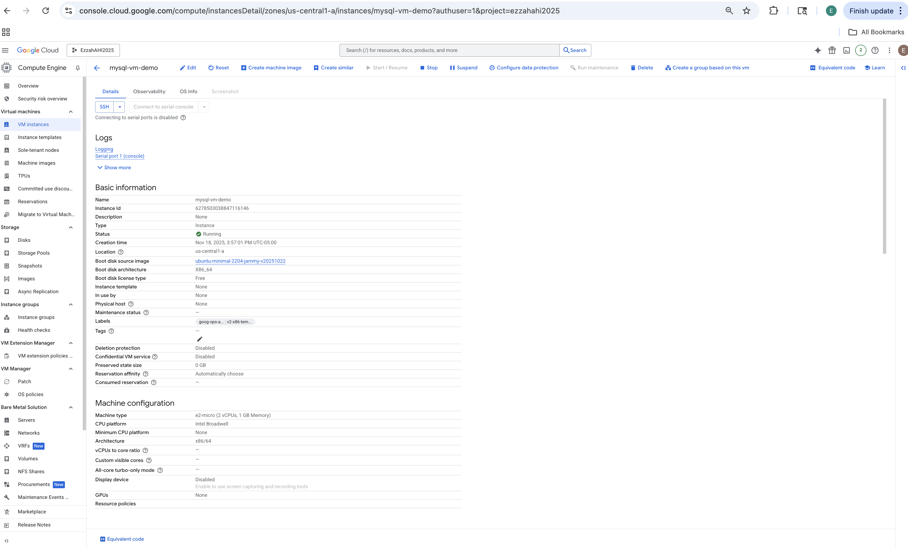
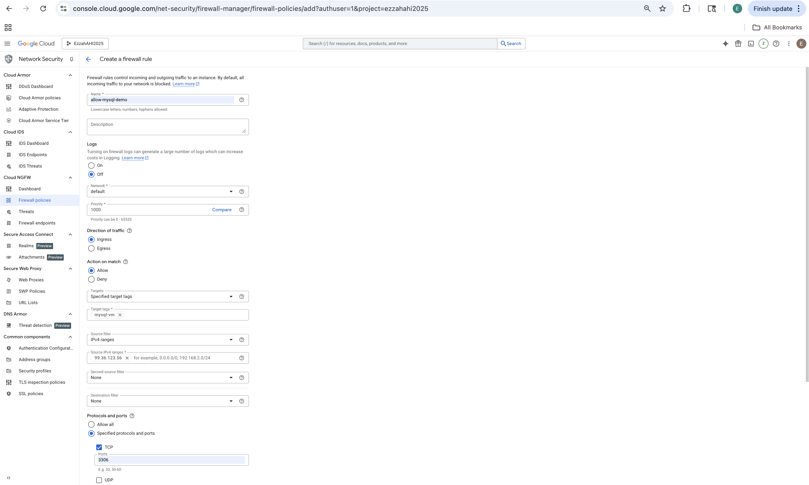
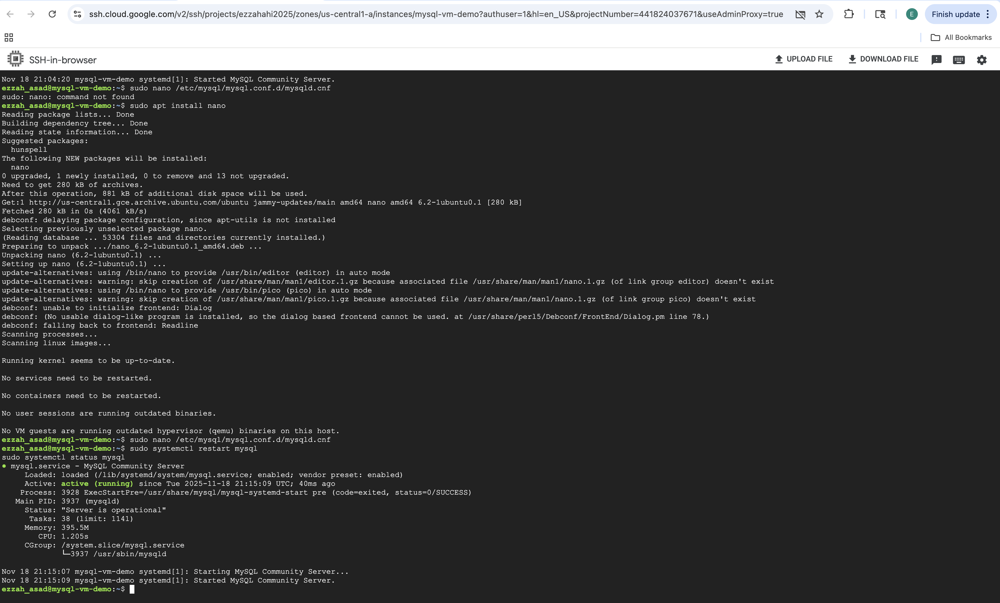
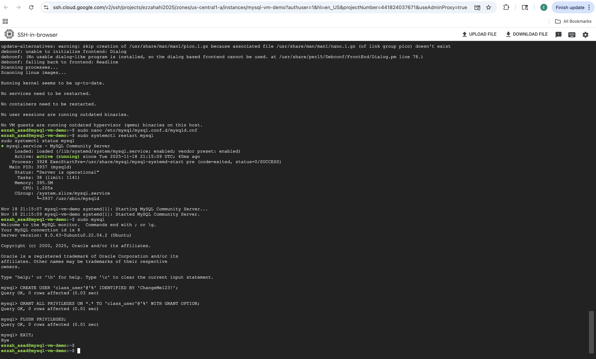
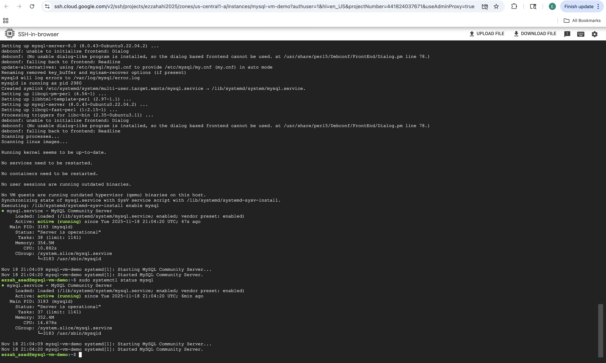

# Setup Notes — MySQL on VM (Self-Managed)

## 1. VM Provisioning (GCP Compute Engine)

**Cloud:** Google Cloud Platform  
**Region:** us-central1  
**Machine type:** e2-micro  
**OS:** Ubuntu 24.04 LTS Minimal  
**Boot disk:** Balanced Persistent Disk, 10 GB  
**Firewall:** Enabled HTTP/HTTPS + custom rule for port **3306**  

### Steps Performed
1. Opened **Compute Engine → Create VM**.
2. Selected:
   - OS: Ubuntu 24.04 LTS Minimal  
   - Machine type: e2-micro  
   - Disk: 10 GB Balanced PD  
3. Under **Network → Firewall**, enabled:
   - Allow HTTP traffic  
   - Allow HTTPS traffic  
4. Created a separate firewall rule to open **TCP 3306** so MySQL could accept external connections.
5. Completed VM creation with these settings.

**Evidence Screenshots:**
- 
- 
- 

---

## 2. Connect to the VM

I connected to the VM using the **SSH-in-browser** terminal provided by GCP. All remaining setup steps were done through this terminal session.

---

## 3. Install & Configure MySQL Server

### Commands Executed

```bash
sudo apt update
sudo apt install mysql-server -y
```

### Check service status

```bash
sudo systemctl status mysql
```

The output confirmed that MySQL was running and the service was active.

**Screenshot:**  


---

## 4. Secure MySQL & Create User/Database

### Enter MySQL shell:

```bash
sudo mysql
```

Inside the MySQL shell, I created the database and user and granted privileges:

```sql
CREATE DATABASE class_db_ezzahai;
CREATE USER 'class_user'@'%' IDENTIFIED BY 'yourpassword';
GRANT ALL PRIVILEGES ON class_db_ezzahai.* TO 'class_user'@'%';
FLUSH PRIVILEGES;
```

**Screenshot:**  


---

## 5. Bind MySQL to Public Interface

To allow external connections, I edited the MySQL configuration file:

```bash
sudo nano /etc/mysql/mysql.conf.d/mysqld.cnf
```

I changed the bind address to:

```
bind-address = 0.0.0.0
```

Then I restarted the service:

```bash
sudo systemctl restart mysql
```

**Screenshot:**  


---

## 6. Test MySQL & Confirm Table Creation

I checked the MySQL version:

```bash
mysql --version
```

Then logged in using:

```bash
mysql -u class_user -p
```

Inside the shell, I ran:

```sql
SHOW DATABASES;
USE class_db_ezzahai;
SHOW TABLES;
```

This confirmed that the database existed and MySQL was working as expected.

**Screenshot:**  
[mysql_table](../screenshots/vm/vm_mysql_tables_and_data.png)

---

## 7. Python SQLAlchemy + pandas Test Against VM

I then ran the provided Python script:

```
python scripts/vm_demo.py
```

The script successfully connected to the VM MySQL server, created the `visits` table, inserted rows from a pandas DataFrame, and read the table back.

**Screenshot:**  
[successful_python](../screenshots/vm/successful_python.png)

---

## 8. Issues Encountered & Fixes

### Issue: MySQL not accepting external connections
**Cause:** The bind-address was still set to `127.0.0.1` and the firewall did not allow port 3306.  
**Fix:** Updated the bind-address to `0.0.0.0` and created the firewall rule for port 3306.

### Issue: Error reading data in Python
**Cause:** A small typo in the SQLAlchemy query caused the connection to close.  
**Fix:** Corrected the SQL query format, and the script ran successfully.

---

## 9. Total Time to Complete VM Setup
The full VM setup (VM provisioning, MySQL installation, configuration, testing, and running the Python script) took about **55 minutes**.


